# arm-riscv-benchmark-results

Cross-architecture performance analysis: **ARM Cortex-M4 (CMSIS)** vs **RISC-V Andes D25F (NMSIS / Andes DSP)**  
Covers DSP kernels, Neural Network operators, and full model inference measured on real silicon.

Master's thesis - **TU Chemnitz × Infineon Technologies**, Dresden (2025).

**Source code:**
- ARM benchmarks → [ARM-Project](https://github.com/Karthik-Swaminathan98/ARM-Project)
- RISC-V benchmarks → [RISCV-Project](https://github.com/Karthik-Swaminathan98/RISCV-Project)
- Code size analysis → [mcu-function-size-analyser](https://github.com/Karthik-Swaminathan98/mcu-function-size-analyser)

---

## Results at a glance

- NMSIS-NN runs KWS DS-CNN Small **1.44× faster** than CMSIS-NN end-to-end (11.6M vs 16.6M cycles).
- ANDES Magnitude Q15 runs **3.32× fewer cycles** than CMSIS and uses **14.8× less stack**.
- On CIFAR-10, NMSIS is up to **6.32× faster** than the ANDES library on Conv2 — fused SIMD MACs vs scalar arithmetic.
- ANDES FIR Q15 is **3.07×** faster than CMSIS at N=1024 using `SMALDA`/`SMALXDA` packed MACs.
- CMSIS beats NMSIS on FIR F32 cycle count (0.74×) — 8-tap unrolled loop vs 2-tap scalar FPU in ANDES.

---

## Hardware

| | ARM Platform | RISC-V Platform |
|---|---|---|
| Board | CY8CKIT-062-WIFI-BT (PSoC6) | Telink B91 |
| Core | Cortex-M4 (Armv7E-M) | Andes D25F (RV32IMACFDBP) |
| Pipeline | 3-stage in-order | 5-stage in-order |
| Clock (bench) | 25 MHz | 24 MHz |
| SRAM | 288 KB | 256 KB |
| SIMD extensions | DSP, FPU, VFP | P-extension (packed SIMD), FPU |

| ARM — PSoC6 (CY8CKIT-062) | RISC-V — Telink B91 |
|:---:|:---:|
| 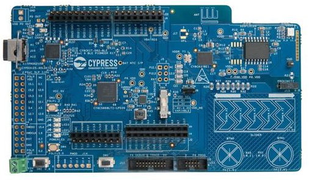 | 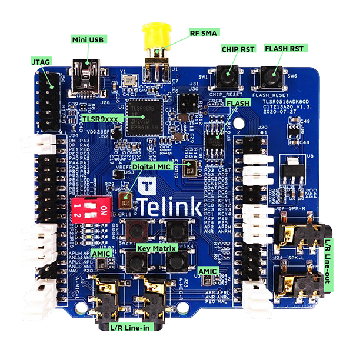 |

---

## Methodology

### Toolchains and build configuration

| | ARM | RISC-V |
|---|---|---|
| Compiler | GNU ARM GCC 13.3 | riscv-32-elf-gcc 7.4 |
| IDE / SDK | ModusToolbox 3.4 | AndeSight RDS 3.2 |
| Optimisation | `-O3 -flto -ffunction-sections -fdata-sections` | Same flags |
| Libraries | CMSIS-DSP v1.15, CMSIS-NN v4.1 | NMSIS-DSP/NN v1.3, Andes DSP v2.6 |

**Library sources:**

| Library | Link |
|---|---|
| CMSIS-DSP | [ARM-software/CMSIS-DSP v1.16.2](https://github.com/ARM-software/CMSIS-DSP/tree/v1.16.2) |
| CMSIS-NN | [ARM-software/CMSIS-NN](https://github.com/ARM-software/CMSIS-NN) |
| NMSIS-DSP | [Nuclei-Software/NMSIS v1.3.1](https://github.com/Nuclei-Software/NMSIS/tree/1.3.1) |
| NMSIS-NN | [Nuclei-Software/NMSIS v1.3.1](https://github.com/Nuclei-Software/NMSIS/tree/1.3.1) |
| Andes DSP | [andestech/libdsp](https://github.com/andestech/libdsp) |
| Andes NN | [andestech/libnn](https://github.com/andestech/libnn) |

### Execution conditions

All code runs from RAM only — no flash wait-states (`cy_ramfunc` attribute on ARM; vendor linker script on RISC-V). Interrupts are disabled during measurement. Each kernel is a standalone binary. No cache or interrupt activity occurs during measurement.

### Cycle count

| Platform | Mechanism |
|---|---|
| ARM (PSoC6) | `DWT->CYCCNT` — 32-bit hardware cycle counter in the CoreSight DWT unit. Read before and after the kernel under test. |
| RISC-V (Telink B91) | `NDS_MCYCLE` CSR — 64-bit machine cycle counter. Direct `csrr` instruction read; no overhead from function calls. |

### Instruction count

| Platform | Mechanism |
|---|---|
| ARM (PSoC6) | Derived from DWT auxiliary counters: `CYCCNT − CPICNT − EXCCNT − SLEEPCNT − LSUCNT + FOLDCNT`. This is an approximation; multi-cycle instructions are not decomposed. |
| RISC-V (Telink B91) | `NDS_MINSTRET` CSR — exact retired instruction count. Every retired instruction is counted by hardware, including RVC (compressed 16-bit) instructions. |

### Stack usage — stack-paint technique

The stack region is pre-filled with the sentinel pattern `0xAAAAAAAA` before kernel execution. After the kernel returns, the stack is scanned from the bottom to find the highest address that no longer contains the sentinel. The difference between the initial stack pointer and this watermark gives the peak stack consumption in bytes. The watermark includes callee-saved registers, prologue/epilogue, and any temporary allocations.

| Before execution (painted) | After execution (consumed) |
|:---:|:---:|
| 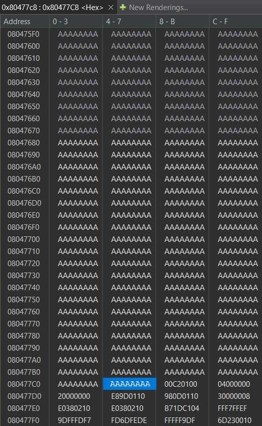 | 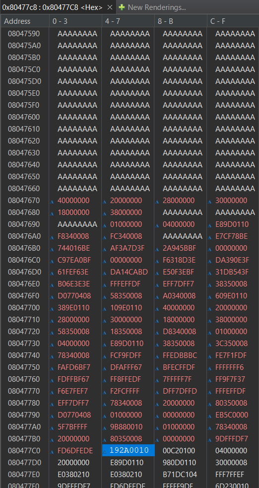 |

### Code size

Code size per function is extracted from the `.map` file generated at link time. A custom call-graph analyser ([mcu-function-size-analyser](https://github.com/Karthik-Swaminathan98/mcu-function-size-analyser)) walks the dependency tree using `objdump` output to attribute only the sections reachable from a given entry point. Shared utility functions are counted once per kernel, not per call site.

---

## How to read the charts

> All DSP and NN kernel results are **normalised to CMSIS (ARM) = 1.0** (dashed baseline).
> - Value **> 1.0** → RISC-V library outperforms CMSIS on that metric
> - Value **< 1.0** → CMSIS outperforms that RISC-V library
> - For stack: value > 1.0 means **less stack used** (more memory-efficient)

Model inference results (Part 3) show absolute cycle counts for direct comparison.

---

## Part 1 — DSP Kernel Results

Three RISC-V library variants are compared against CMSIS-DSP as the baseline. **ANDES** is the Andes proprietary DSP library, using custom P-extension intrinsics. **NMSIS** is the open-source NMSIS-DSP library, the RISC-V community equivalent of CMSIS-DSP.

### 1.1 DSP Summary — All Kernels

The charts below span all four DSP kernel groups (Transform/FFT, Magnitude, FIR, Fast Math) across both F32 and Q15 data types.

#### Cycle Count Efficiency
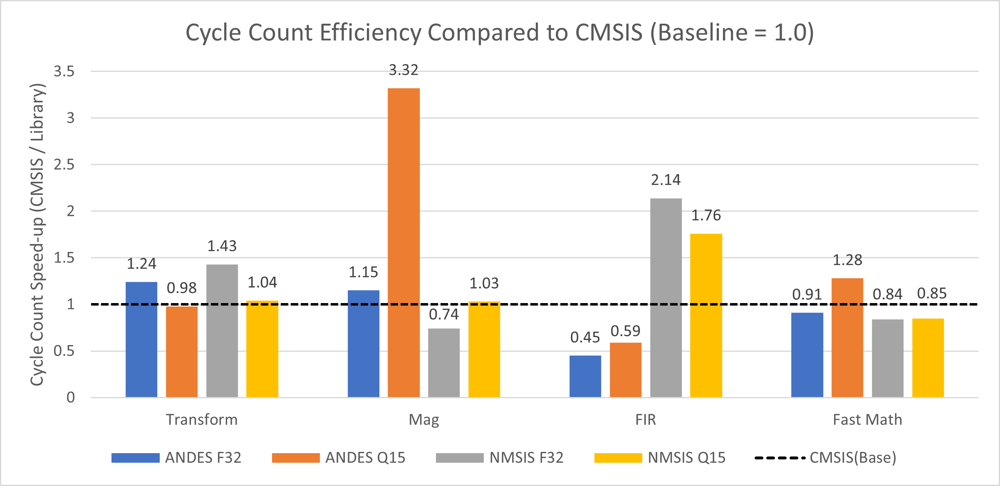

#### Instruction Count Efficiency
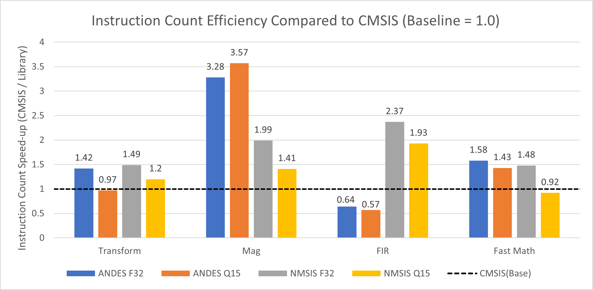

#### Execution Time Efficiency
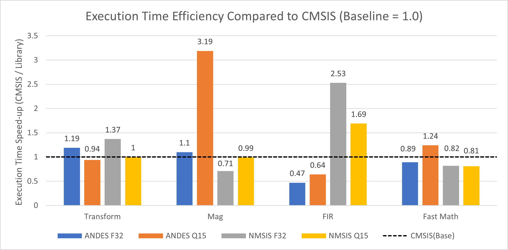

#### Stack Usage Efficiency
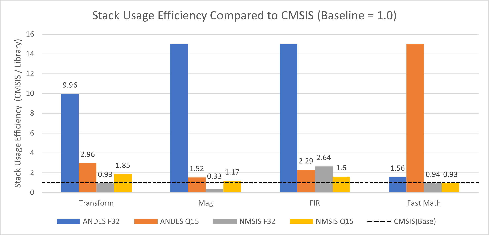

#### Code Size Efficiency
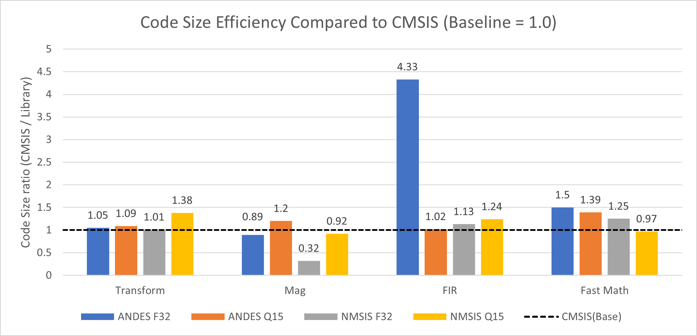

---

### 1.2 Transform — Complex FFT F32

FFT size N swept from 32 to 1024. NMSIS and ANDES both outperform CMSIS on cycle count at most sizes. ANDES achieves the largest stack reduction (up to 43× at N=32: 8 B vs 344 B) due to iterative implementation with register-resident twiddle factors.

| Function | Library | Cycle | Instruction | Stack | Code Size |
|---|---|---|---|---|---|
| FFT F32 | ANDES | 1.24× faster | 1.42× fewer | 9.96× less | 1.05× |
| FFT F32 | NMSIS | 1.43× faster | 1.49× fewer | 3.41× less | 1.01× |
| FFT Q15 | ANDES | ~1.0× | 0.97× | 1.85× less | 1.09× |
| FFT Q15 | NMSIS | 1.15× faster | 1.20× fewer | 1.52× less | 0.62× smaller |

---

### 1.3 Filtering — FIR F32

CMSIS wins on FIR F32 cycle count (ANDES: 0.74×, NMSIS: 2.53×). CMSIS uses an 8-tap unrolled loop; ANDES uses scalar `fmul.s + fadd.s` with a 2-tap unroll, generating more load-store traffic per output despite the FPU being present on both cores.

---

### 1.4 Filtering — FIR Q15

NMSIS (2.14×) and ANDES (3.07× at large N) both outperform CMSIS on Q15, driven by packed SIMD MACs (`SMALDA`/`SMALXDA`) that process two Q15 samples per instruction. ANDES achieves 15× less stack by keeping the accumulator register-resident.

| Function | Library | Cycle | Instruction | Stack | Code Size |
|---|---|---|---|---|---|
| FIR F32 | ANDES | 0.74× (CMSIS wins) | 0.64× | 2.29× less | 4.33× larger |
| FIR F32 | NMSIS | 2.53× faster | 2.37× fewer | 1.60× less | 1.02× |
| FIR Q15 | ANDES | 3.07× faster | — | 15× less | 1.13× |
| FIR Q15 | NMSIS | 2.14× faster | 1.93× fewer | 2.64× less | 1.24× |

---

### 1.5 Magnitude — Complex Magnitude Q15

ANDES achieves **3.32× fewer cycles** on Magnitude Q15 by using a Q15-specific square-root and `pkbb16` packed store to process two samples per iteration, bypassing CMSIS's general-purpose Q31 path. NMSIS provides 1.76× improvement with similar packed operations.

| Function | Library | Cycle | Instruction | Stack | Code Size |
|---|---|---|---|---|---|
| Magnitude F32 | ANDES | 1.04× faster | 1.99× fewer | 1.52× less | 0.89× |
| Magnitude F32 | NMSIS | 1.15× faster | 1.41× fewer | 0.33× (CMSIS wins) | 4.33× larger |
| Magnitude Q15 | ANDES | **3.32× faster** | 3.57× fewer | **14.8× less** | 0.92× |
| Magnitude Q15 | NMSIS | 1.76× faster | 1.93× fewer | 1.17× less | 1.20× |

---

### 1.6 Fast Math (sqrt, sin, cos, atan2)

CMSIS wins on F32 cycle count (ANDES: 0.91×, NMSIS: 0.84×). The CMSIS floating-point math kernels are more mature and better vectorised. ANDES wins on Q15 (1.28×) and achieves 15× less stack through register-resident lookup tables.

| Function | Library | Cycle | Instruction | Stack | Code Size |
|---|---|---|---|---|---|
| Fast Math F32 | ANDES | 0.91× (CMSIS wins) | 1.43× fewer | ~1.0× | 1.50× |
| Fast Math F32 | NMSIS | 0.84× (CMSIS wins) | 1.58× fewer | 0.93× | 1.39× |
| Fast Math Q15 | ANDES | 1.28× faster | 1.48× fewer | **15× less** | 1.25× |
| Fast Math Q15 | NMSIS | 0.85× (CMSIS wins) | 0.92× | 1.56× less | 0.97× |

---

## Part 2 — Neural Network Kernel Results

Comparison: **NMSIS-NN (RISC-V) vs CMSIS-NN (ARM)**. S8 = INT8. S16 = INT16. All kernels tested with representative tensor dimensions from a DS-CNN workload.

### 2.1 NN Summary — All Kernels

#### Cycle Count Efficiency (NMSIS-NN vs CMSIS-NN)
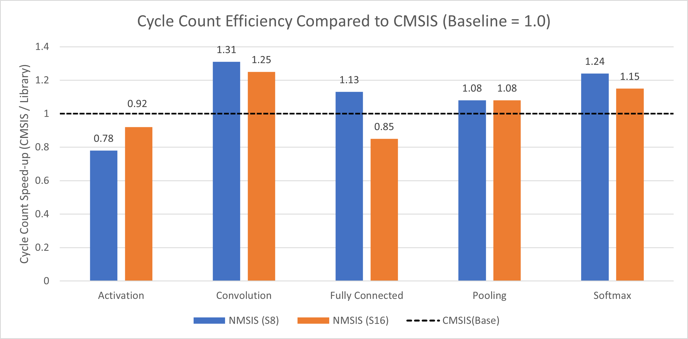

#### Instruction Count Efficiency
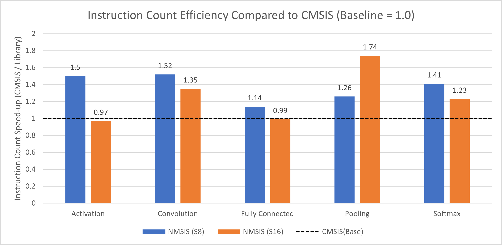

#### Execution Time Efficiency
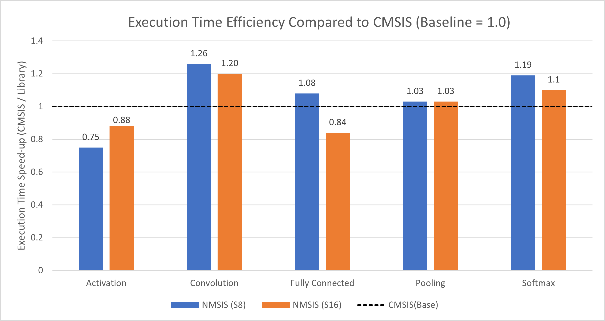

#### Stack Usage Efficiency
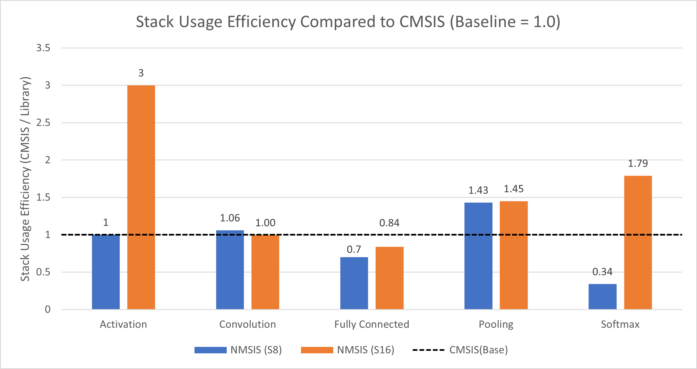

#### Code Size
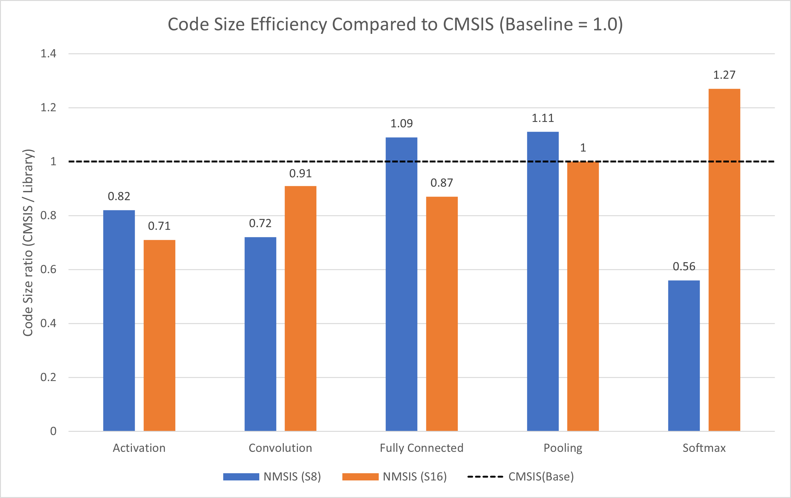

---

### 2.2 Activation (ReLU6 S8, Activation S16)

CMSIS wins on S8 cycle count (0.78×). ARM's conditional execution (`it ge / movge`) skips the high-clamp evaluation entirely for in-range values. NMSIS always evaluates both `maxw` and `minw`, paying for the branch-free path even when it is not needed.

| Metric | NMSIS S8 | NMSIS S16 |
|---|---|---|
| Cycle count | 0.78× (CMSIS wins) | 0.92× (CMSIS wins) |
| Instruction count | 1.50× faster | 0.97× (CMSIS wins) |
| Stack usage | 1.00× (same) | 3.00× less |
| Execution time | 0.75× (CMSIS wins) | 0.88× (CMSIS wins) |
| Code size | 0.82× smaller | 0.71× smaller |

---

### 2.3 Convolution (Conv2D, Depthwise Conv — S8 and S16)

NMSIS wins consistently. P-extension operations (`kmada`, `sunpkd820`, `pktt16`/`pkbb16`) collapse the ARM 12–16 instruction unpack-MAC sequence into 6–8 instructions, nearly halving dynamic instruction cost per output element.

| Metric | NMSIS S8 | NMSIS S16 |
|---|---|---|
| Cycle count | **1.31× faster** | **1.25× faster** |
| Instruction count | **1.52× fewer** | **1.35× fewer** |
| Stack usage | 1.06× | 1.00× (same) |
| Execution time | **1.26× faster** | **1.20× faster** |
| Code size | 0.72× smaller | 0.91× smaller |

---

### 2.4 Fully Connected (S8 and S16)

NMSIS wins on S8 (1.13×). CMSIS wins on S16 (0.85×): back-to-back `kmada` instructions create read-after-write hazards in the 5-stage Andes pipeline, forcing stall cycles. CMSIS `smlad`-based dual-MAC loops have shorter dependency chains that match the ARM 3-stage pipeline better.

| Metric | NMSIS S8 | NMSIS S16 |
|---|---|---|
| Cycle count | **1.13× faster** | 0.85× (CMSIS wins) |
| Instruction count | **1.14× fewer** | 0.99× (CMSIS wins) |
| Stack usage | 0.84× (CMSIS wins) | 0.70× (CMSIS wins) |
| Execution time | **1.08× faster** | 0.84× (CMSIS wins) |

---

### 2.5 Pooling — Average Pooling (S8 and S16)

| Metric | NMSIS S8 | NMSIS S16 |
|---|---|---|
| Cycle count | **1.08× faster** | **1.08× faster** |
| Instruction count | **1.26× fewer** | **1.74× fewer** |
| Stack usage | **1.43× less** | **1.45× less** |
| Execution time | 1.03× faster | 1.03× faster |

---

### 2.6 Softmax (S8 and S16)

NMSIS wins on both datatypes for cycles and instructions. On S8 stack, NMSIS allocates a 608 B temporary buffer; CMSIS uses an inline approach and is 2.9× more stack-efficient on S8 Softmax.

| Metric | NMSIS S8 | NMSIS S16 |
|---|---|---|
| Cycle count | **1.24× faster** | **1.15× faster** |
| Instruction count | **1.41× fewer** | **1.23× fewer** |
| Stack usage | 0.34× (CMSIS wins — 608 B buffer) | **1.79× less** |
| Execution time | **1.19× faster** | **1.10× faster** |
| Code size | 1.27× larger | 0.56× smaller |

---

## Part 3 — Model Inference Results

End-to-end bare-metal inference. No OS, no runtime. Each model is compiled with CMSIS-NN (ARM) and NMSIS-NN (RISC-V) quantised kernels and executed layer-by-layer with per-layer cycle and stack measurement.

---

### 3.1 CIFAR-10 Image Classification

**Platform comparison:** ANDES library vs NMSIS library, both on RISC-V (Telink B91 / Andes D25F)  
**Model:** 3-layer quantised CNN (INT8), input 32×32 RGB

| Layer | ANDES cycles | NMSIS cycles | NMSIS speedup |
|---|---|---|---|
| Preprocess | 21,517 | 28,688 | 0.75× |
| Conv1 | 17,681,954 | 5,267,023 | **3.36×** |
| ReLU1 | 378,681 | 106,531 | **3.55×** |
| Pool1 | 1,633,962 | 183,976 | **8.88×** |
| Conv2 | 27,302,881 | 4,321,937 | **6.32×** |
| ReLU2 | 46,396 | 13,341 | **3.48×** |
| Pool2 | 201,941 | 27,419 | **7.36×** |
| Conv3 | 6,307,995 | 1,080,566 | **5.84×** |
| ReLU3 | 25,460 | 6,686 | **3.81×** |
| Pool3 | 98,399 | 11,314 | **8.70×** |
| FC | 23,659 | 13,023 | **1.82×** |
| Softmax | 438 | 442 | ~1.0× |

NMSIS outperforms ANDES on every Conv and Pool layer. The Conv2 gap (6.32×) reflects NMSIS fused MAC operations vs ANDES scalar arithmetic. ANDES uses less stack per layer due to compact function prologues; NMSIS allocates larger frames to enable SIMD register reuse.

| Layer | ANDES stack (B) | NMSIS stack (B) |
|---|---|---|
| Conv1/2/3 | 104–116 | 204–216 |
| Pool1/2/3 | 52 | 92 |
| FC | 116 | 100 |

---

### 3.2 Keyword Spotting — DS-CNN Small

**Platform comparison:** ARM Cortex-M4 (CMSIS-NN) vs RISC-V Andes D25F (NMSIS-NN)  
**Model:** DS-CNN Small (INT8), 10-class keyword recognition, 13 layers

| Layer | CMSIS cycles | NMSIS cycles | NMSIS speedup |
|---|---|---|---|
| Layer 1: DEPTHWISE_CONV_2D | 3,101,817 | 1,523,422 | **2.04×** |
| Layer 2: DEPTHWISE_CONV_2D | 916,249 | 541,043 | **1.69×** |
| Layer 3: CONV_2D | 1,770,642 | 1,449,606 | **1.22×** |
| Layer 4: DEPTHWISE_CONV_2D | 916,249 | 541,043 | **1.69×** |
| Layer 5: CONV_2D | 1,770,642 | 1,449,606 | **1.22×** |
| Layer 6: DEPTHWISE_CONV_2D | 916,249 | 541,043 | **1.69×** |
| Layer 7: CONV_2D | 1,770,642 | 1,449,606 | **1.22×** |
| Layer 8: DEPTHWISE_CONV_2D | 916,249 | 541,043 | **1.69×** |
| Layer 9: CONV_2D | 1,770,642 | 1,449,606 | **1.22×** |
| Layer 10: DEPTHWISE_CONV_2D | 916,249 | 541,043 | **1.69×** |
| Layer 11: CONV_2D | 1,770,642 | 1,449,606 | **1.22×** |
| Layer 12: AVERAGE_POOL_2D | 64,154 | 76,300 | 0.84× |
| Layer 13: FULLY_CONNECTED | 3,207 | 3,942 | 0.81× |
| **TOTAL** | **16,603,633** | **11,556,909** | **1.44× faster** |

NMSIS runs the full DS-CNN Small model **1.44× faster** (16.6M vs 11.6M cycles). CMSIS uses less total stack (4,724 B vs 6,348 B), largely due to the FC layer where NMSIS allocates a larger frame.

| Layer type | CMSIS stack (B) | NMSIS stack (B) |
|---|---|---|
| DEPTHWISE_CONV_2D | 248 | 468 |
| CONV_2D | 572 | 584 |
| AVERAGE_POOL_2D | 160 | 112 |
| FULLY_CONNECTED | 216 | 508 |
| **Total** | **4,724** | **6,348** |

---

### 3.3 Keyword Spotting — DS-CNN Medium

**Model:** DS-CNN Medium (INT8) — same topology as Small, larger feature maps (more channels)

| Layer | CMSIS cycles | NMSIS cycles | NMSIS speedup |
|---|---|---|---|
| Layer 1: DEPTHWISE_CONV_2D | 14,101,480 | 6,970,463 | **2.02×** |
| Layer 2: DEPTHWISE_CONV_2D | 1,369,318 | 804,113 | **1.70×** |
| Layer 3: CONV_2D | 5,197,590 | 4,626,485 | **1.12×** |
| Layer 4: DEPTHWISE_CONV_2D | 1,235,176 | 736,936 | **1.68×** |
| Layer 5: CONV_2D | 5,197,590 | 4,626,485 | **1.12×** |
| Layer 6: DEPTHWISE_CONV_2D | 1,235,176 | 736,936 | **1.68×** |
| Layer 7: CONV_2D | 5,197,590 | 4,626,485 | **1.12×** |
| Layer 8: DEPTHWISE_CONV_2D | 1,235,176 | 736,936 | **1.68×** |
| Layer 9: CONV_2D | 5,197,590 | 4,626,485 | **1.12×** |
| Layer 10: DEPTHWISE_CONV_2D | 1,235,176 | 736,936 | **1.68×** |
| Layer 11: CONV_2D | 5,197,590 | 4,626,485 | **1.12×** |
| Layer 12: AVERAGE_POOL_2D | 86,141 | 105,758 | 0.81× |
| Layer 13: FULLY_CONNECTED | 6,464 | 9,350 | 0.69× |
| **TOTAL** | **46,492,057** | **33,969,853** | **1.37× faster** |

NMSIS runs DS-CNN Medium **1.37× faster** (46.5M vs 34.0M cycles). Depthwise convolution layers show the largest gains (1.68–2.02×), consistent with P-extension SIMD efficiency on quantised depthwise operators. Stack profile is identical to DS-CNN Small (same layer types).

---

## Part 4 — Key Takeaways

### Where RISC-V (NMSIS / Andes) wins

| Domain | Best result | Reason |
|---|---|---|
| FFT F32 | 1.47× fewer cycles (NMSIS) | Fused `fmadd.s`, fewer load-store pairs |
| Magnitude Q15 | **3.32× fewer cycles** (ANDES) | Q15-specific sqrt, `pkbb16` packed output |
| FIR Q15 | 3.07× fewer cycles (ANDES) | `SMALDA`/`SMALXDA` packed MAC, RVC compression |
| Convolution S8 | 1.31× fewer cycles (NMSIS) | P-extension `kmada`, `sunpkd820` unpack |
| Pooling S8/S16 | 1.74× fewer instructions (NMSIS) | `maxw`/`minw` fused compare-select |
| Softmax S16 | 1.23× fewer instructions (NMSIS) | `smar64` saturating MAC replaces `smlal`+clamp |
| KWS DS-CNN Small | **1.44× faster** end-to-end | Consistent depthwise conv advantage |
| KWS DS-CNN Medium | **1.37× faster** end-to-end | Same architecture, larger feature maps |
| CIFAR-10 Conv | up to **6.32× fewer cycles** (NMSIS) | SIMD fused MAC vs scalar ANDES arithmetic |
| Stack (DSP) | Up to **14.8× less** (ANDES Mag Q15) | Register-resident loops, compact prologues |

### Where ARM (CMSIS) wins

| Domain | Result | Reason |
|---|---|---|
| FIR F32 | 0.74× (CMSIS faster) | 8-tap loop unrolling, fused MACs amortise load-store cost |
| Activation S8 (ReLU6) | 0.78× (CMSIS faster) | `it ge / movge` conditional execution skips high-clamp on in-range values |
| Fully Connected S16 | 0.85× (CMSIS faster) | `smlad` dual-MAC, shorter dependency chains on 3-stage pipeline |
| Fast Math F32 | 0.91× (CMSIS faster) | More mature floating-point math kernels |
| Softmax S8 stack | 2.9× less stack | NMSIS allocates 608 B temporary buffer |

### Overall conclusion

RISC-V libraries match or beat CMSIS on most fixed-point DSP and quantised NN kernels. Depthwise convolution gains compound across model layers: KWS inference runs 1.37–1.44× faster on RISC-V. ARM holds advantages on FIR F32, ReLU6 S8, and Fully Connected S16 — cases where conditional execution or tight MAC scheduling offset the P-extension gains.

---

## Acknowledgements

Master's thesis at **Technische Universität Chemnitz**  
(Chair of Computer Architectures and Systems)  
in collaboration with **Infineon Technologies**, Dresden.

Supervised by Prof. Dr. Alejandro Masrur · Mr. Daniel Markert · Dr. Elias Trommer · Mr. Jerome Almon Swamidasan

---

## Author

**Karthik Swaminathan** — Embedded Firmware Engineer  
M.Sc. Embedded Systems · TU Chemnitz  
[LinkedIn](https://linkedin.com/in/karthik-swaminathan98) · karthik94870@gmail.com
